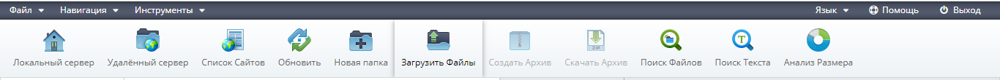

# Развёртывание проекта Laravel для Веб-хостинга | For true dev
***
### Настройка локального окружения    (OsPanel, GitBash, Composer)
<h3>1. Установка OpenServer</h3>
Не стал ставить все компоненты, поставил только нужные для развёртывания Laravel'a. 
Можете выполнять стандартную установку со всеми предлагаемымми компонентами. 
 

У меня вышло чёт такое:

  

  

<h4>Для развёртывания Laravel хватит и этих модулей:</h4>
1. HTTP: Apache_2.4PHP_8.0 (есть вариация с NGINX, но её лучше не использовать иначе нужно будет беседовать с composer'om)
2. Php: PHP_8.0

  

<b>Сохранить и перезагрузить OSPanel</b>

<h3>2. Установка Git'a</h3>

Можете выбрать редактор кода, который больше нравится вам или оставить поумолчанию. В моём предпочтении VsCode

Остальные настройки по умолчанию

  

<h3>3. Установка Composer'a</h3>

Да, он вроде шёл вместе с OSPanel, но привычка, и так действительно лучше) 

Прокладываете путь к модулю пыхи в OsPanel Остальное по умолчанию

  

Для проверки что всё установлено правильно, можете зайти в gitBash и прописать:
<code>composer --version</code>

  

***

<h2>Развёртывание проекта Laravel на локальной машине</h2>
1. Стартуем OsPanel;
2. Открываем GitBash (можно просто ввести в меню пуск git скорее всего git bash будет первым в списке);
3. В GitBash'e переходим в директорию <code>OpenServer\domains</code> у меня это <code>C:\OpenServer\domains</code> для этого в bash'e нужно написать следующее   <code>cd /C/OpenServer/domains/
   </code>  

     

4. Качаем проект через <b>composer</b>. Для этого в bash вводим:   <code>composer create-project laravel/laravel</code>  
     
    
     
    
     

5. После автоматической установки всех пакет и обновления всех зависимостей. Переходим в папке проекта. GitBash:   
<code>cd laravel</code>  

     

6. Проверяем, что проект работает запуская его:   
<code>php artisan serve</code>
     
7. В браузере переходим по адресу: <code>http://127.0.0.1:8000 </code>
    
Если всё ОК, то видим следующее

      

<h2>Подготовка проекта к отправке на хостинг</h2>
1. 
Чтобы вернуть возможность писать команды в Bash'e и выключить сервер используем сочетание клавиш: <code>CTRL + C</code> 

2. 
В директории <code>domains\laravel</code> ищем два файла <code>composer.json</code> и <code>composer.lock</code> открываем их любом текстовом редакторе.
 
3. 
В файле <code>composer.json</code> редактируем строчку № 8, <code>"php": "^7.3|^8.0"</code> в итоге должно получиться <code>"php": "^7.3"</code>, сохраняем файл 

4. 
В файле <code>composer.lock</code> редактируем строчку № 24,  <code>"php": "^7.0|^8.0"</code> в итоге должно получиться <code>"php": "^7.0"</code>, сохраняем файл

5. В Bash'e вводим <code>composer install --ignore-platform-reqs</code>
      
6. Получаем сообщение:
      
7. Можно закрыть Bash.
8. Архивируем папку Laravel.

<h2>Подготовка хостинга для загрузки проекта</h2>
1. Переходим в админ панель хостинга под своими данными.
2. Заходим во вкладку "Sites"
  
3. Нажимаем на шестерёнку в форме "Sites and linked domains" 
  
4. Меняем версию php с 5.6 на 7.4
      
      
5. Возвращаемся на главную страницу админки
6. Переходим на вкладку "File manager" 
      
7. После того как перешли в Файловый менеджер заходим в папку с сайтом у меня это <code>e92507ja.beget.tech</code>
      
8. В папку с сайтом <code>e92507ja.beget.tech</code> грузим наш проект архивом <code>laravel.7z[.rar, .zip]</code>

Для этого в менюшке сверху выбираем "Загрузить файлы"

  

Дальше жмём <b>Browse...</b> и выбираем архив и жмём "Открыть" потом в форме нажимаем "Загрузка" 

  
     
  

После того как файл был загружен можем закрыть форму

  

Жмём по архиву "ПКМ" - "Распаковать архив" 

  

Распаковка займёт какое-то время. 

Спустя 5-8 мин. Архив распакован.   
В итоге в папке <code>e92507ja.beget.tech</code> у нас находятся 3 файла: папка <code>laravel</code>, папка <code>public_html</code>, архив <code>laravel.7z</code>

  

9. 
В левом окне открываем папку <code>laravel</code>, а вправом папку <code>public_html</code> и в правом окне удаляем все файлы кроме папки   <code>cgi-bin</code> в итоге должно выглядить как на скриншоте ниже

   
  
10. 
В левом окне переходим в папку <code>public</code>, выделяем все файлы кроме <code>..</code>, далее жмём "ПКМ" - "Переместить"

  

11. 
В итоге, все файлы из папки <code>public</code> переместились в папку <code>public_html</code>

  

12. 
В папке <code>public_html</code> открываем файл <code>index.php</code> чтобы отредактировать его   Нас интересует строка № 34   <code>require __DIR__.'/../vendor/autoload.php';</code>
 

Перед <code>vendor</code> добавляем директорию <code>laravel</code>

В итоге строка должна выглядить так:  <code>require __DIR__.'/../laravel/vendor/autoload.php';</code>

Дальше в этом же файле ищем строку №47:   <code>$app = require_once __DIR__.'/../bootstrap/app.php';</code>

Делаем тоже самое. В итоге строка выглядит, так:   <code>$app = require_once __DIR__.'/../laravel/bootstrap/app.php';</code>

  

Сохраняем файл. "Файл" - "Сохранить".   Можем переходить на главную страницу сайта у меня: <code>http://e92507ja.beget.tech/</code>

Если всё сделано верно, увидим экран приветствия Laravel:

  

***

# Развёртывание проекта Laravel для Веб-хостинга | For not true dev
1. Клонировать репозиторий в любую папку:  
<code>git clone https://github.com/Vampir007one/UploadLaravelToHosting.git </code>
2. Загрузить архив на хостинг, распаковать в корне сайта рядом с папкой <code>public-html</code>. 
3. Удалить все файлы в папке <code>public_html</code> кроме папки <code>cgi-bin</code>.
4. Из папки <code>laravel\public</code> переместить всё в папку <code>public_html</code>
5. Перейти на главую страницу сайта. Всё должно работать
